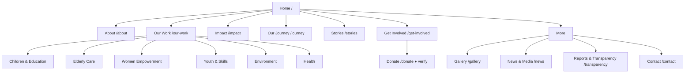

# SAHARA — Recommended Sitemap

**Phase 2 blueprint.** Structure is derived from *actual audited content*, not copied from either existing site. Pages exist only where source material supports them.

## Top-level navigation (7 items + Donate button)

```
Home
About            ▸ Our Story · Mission & Approach · Leadership & Governance · Recognition
Our Work         ▸ Children & Education · Elderly Care · Women Empowerment ·
                   Youth & Skills · Environment · Health   (+ Impact)
Our Journey      (Timeline)
Stories          (Impact stories / success stories)
Get Involved     ▸ Donate · Sponsor a Child · Adopt an Elder · Volunteer & Interns · Partner with Us
More             ▸ Gallery · News & Media · Reports & Transparency · Contact
[ Donate ]  ← persistent button, visually distinct
```

- **7 nav groups** keep the bar clean; **"More"** holds lower-frequency but important pages (Gallery, Press, Reports, Contact) so the primary bar stays action-focused.
- **Donate** is a button, not a nav item — always visible (see `mobile-ux.md` for sticky behavior).

## Full page list & URLs (12 standalone pages + homepage)

| # | Page | URL | Standalone or section? | Nav location |
|---|---|---|---|---|
| 1 | Home | `/` | Standalone | — |
| 2 | About (Our Story, Mission, Governance, Recognition) | `/about` | Standalone (long, anchored) | About |
| 3 | Our Work (overview + 6 programs) | `/our-work` | Standalone hub; 6 anchored program sections | Our Work |
| 4 | Impact | `/impact` | Standalone (or `/our-work#impact`) | Our Work |
| 5 | Our Journey (Timeline) | `/journey` | Standalone | Our Journey |
| 6 | Stories | `/stories` | Standalone (index + detail) | Stories |
| 7 | Get Involved (hub) | `/get-involved` | Standalone hub | Get Involved |
| 8 | Donate | `/donate` | Standalone (**🟢 data confirmed** — all approved accounts + UPI + cash + platforms; **no FCRA**) | Get Involved + button |
| 9 | Gallery | `/gallery` | Standalone | More |
| 10 | News & Media | `/news` | Standalone | More |
| 11 | Reports & Transparency | `/transparency` | Standalone | More |
| 12 | Contact | `/contact` | Standalone | More |

**Recommended page count: 12 pages + homepage = 13 primary URLs.**

### Optional/expandable (only if content justifies later — do NOT build preemptively)
- Individual **Program detail pages** (`/our-work/children`, …) — *if* each program grows beyond a rich section (source supports 6 sections now; split later only if depth warrants). **[Verify]** current status per program before promoting any to its own page.
- **Story detail pages** (`/stories/<slug>`) — for the 2–3 consented flagship stories.
- **Sponsor a Child** / **Adopt an Elder** as their own pages under Get Involved — recommended once giving tiers are confirmed **[Verify]**.
- **Privacy Policy** (`/privacy`) — **required** if any contact/enquiry form collects personal data (see footer & `accessibility.md`).
- **Terms** — only if online payments are hosted on-site (likely not in v1; giving routed to verified bank/UPI/third-party).
- **Telugu / bilingual** variant — **[Verify]** client appetite (Telugu-speaking region + Telugu press exists).

## Why NOT certain pages
- **No separate "Blog"** — the current site's blog is a dead 404; there is no ongoing article stream. News/Media covers press; add a blog only if the client will maintain it.
- **No standalone "HIV/AIDS" or "Agriculture & Rural Development" pages** — historically standalone [WP] but **not confirmed current**; represented within Health / Environment with a historical note until **[Verify]**.
- **No "Team member" micro-pages** — leadership fits one governance section; names/titles still **[Verify]**.

## Sitemap diagram



> URLs are proposals; final slugs confirmed at build. No routing/code implied here.
